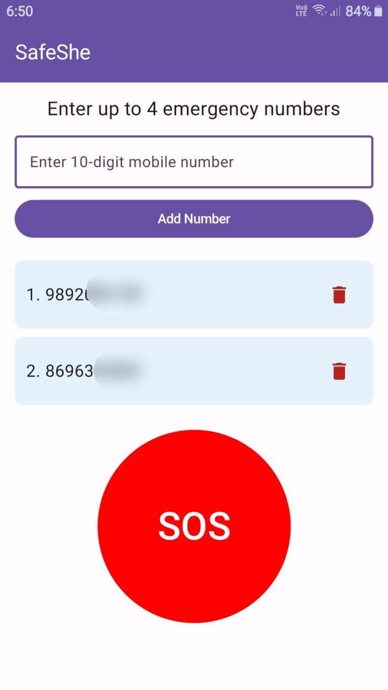

# SafeShe – Comprehensive Women's Safety Mobile Application

## Overview
SafeShe is a women’s safety Android app developed using **Jetpack Compose** and **Android Studio** to enhance personal security. It allows users to quickly send their live location to emergency contacts and provides additional safety features.

## Features
- Add up to **4 emergency contacts**.
- **Persistent contacts**: saved numbers are shown every time the app opens.
- **SOS Button**: sends emergency SMS with your **real-time location**.
- **Shake-to-Send**: trigger SOS by shaking the phone.
- **Silent operation**: after sending SMS, app returns to background to avoid alerting others.
- **Clean UI**: Jetpack Compose-based modern interface with top navigation bar.
